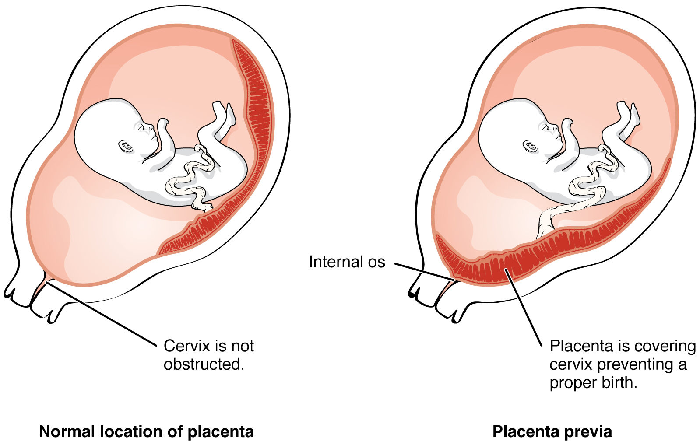
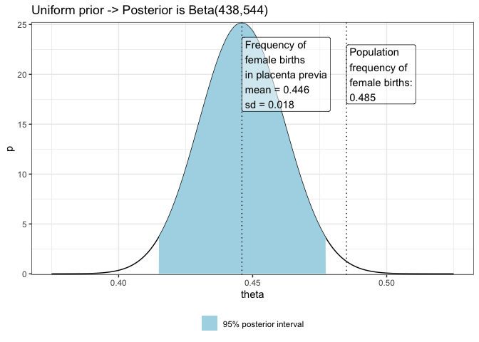

# Bayesian - Probability of a girl birth given placenta previa

Last update:

    ## [1] "2024-11-13"

This doc was built with:
`rmarkdown::render("Bayesian_example1.Rmd", output_file = "../pages/bayesian_example1.md")`

## Introduction

In an interesting Bayesian case study, we examine the probability of a
girl birth among births with the condition placenta previa, where the
placenta obstructs a normal vaginal delivery. An early study in Germany
found that out of 980 births with placenta previa, 437 were female. We
aim to assess the evidence supporting the hypothesis that the proportion
of female births in this condition is less than the general population
proportion of 0.485.


<https://commons.wikimedia.org/wiki/Category:Placenta_previa#/media/File:2906_Placenta_Previa-02.jpg>
CC BY 3.0.

## Bayesian Framework

### Data and Model

We define the observed study data:

- $$X = 437$$ - number of female births in placenta previa
- $$Y = 543$$ - number of male births in placenta previa
- $$n = 980$$ - total births in placenta previa
- $$0.485$$ - frequency of normal female births in the population
- Posterior is Beta(438,544)

The parameter of interest, $$\theta$$, represents the probability of a
female birth in placenta previa cases. We calculate and plot the
posterior distribution of the proportion of $$\theta$$, using uniform
prior on $$\theta$$.

In Bayesian analysis, especially when dealing with proportions like the
probability of a girl birth in this scenario, understanding the entire
distribution is crucial. The Beta distribution, being the conjugate
prior for binomial likelihoods, is particularly sensitive to the shape
parameters ($$\alpha$$ and $$\beta$$), which in this case are derived
from the observed data (437 girls, 543 boys) plus one for each due to
the uniform prior assumption ($$\alpha = X + 1$$,
$$\beta = n - X + 1$$):

- **Alpha (438)**: Represents the number of successes (female births)
  plus one.
- **Beta (544)**: Represents the number of failures (male births) plus
  one.

``` r
library(ggplot2)
theme_set(theme_bw())
# Posterior is Beta(438,544)

# seq creates evenly spaced values
df1 <- data.frame(theta = seq(0.375, 0.525, 0.001)) 
a <- 438
b <- 544 
```

### Prior and Posterior Distributions

Under a **uniform prior distribution** (implying no prior bias towards
specific values), the beta distribution is utilised as the conjugate
prior. The posterior distribution then is:

$$ \text{Posterior}(\theta) = \text{Beta}(\alpha + X, \beta + n - X) = \text{Beta}(438, 544) $$

This choice of prior reflects an initial belief that all values of
$$\theta$$ are equally likely, from 0 to 1.

``` r
# dbeta computes the posterior density
df1$p <- dbeta(df1$theta, a, b)
```

``` r
# compute also 95% central interval
# seq creates evenly spaced values from 2.5% quantile
# to 97.5% quantile (i.e., 95% central interval)
# qbeta computes the value for a given quantile given parameters a and b
df2 <- data.frame(theta = seq(qbeta(0.025, a, b), qbeta(0.975, a, b), length.out = 100))
```

``` r
# compute the posterior density
df2$p <- dbeta(df2$theta, a, b)
```

``` r
data_mean <- round(mean(df2$theta), digits = 3)
data_sd <- round(sd(df2$theta), digits = 3)
data_lab <- paste0("Frequency of\nfemale births\nin placenta previa\nmean = ", data_mean, "\nsd = ", data_sd)
```

``` r
# Plot posterior (Beta(438,544)) and 48.8% line for population average
ggplot(mapping = aes(theta, p)) +
  geom_line(data = df1) +
  # Add a layer of colorized 95% posterior interval
  geom_area(data = df2, aes(fill='1')) +
  
  geom_vline(xintercept = data_mean, linetype='dotted') +
  annotate(geom = "label", label = data_lab, x = data_mean, y = 20, hjust = 0, fill = "white", alpha = 0.5) +
  
  # Add the proportion of girl babies in general population
  geom_vline(xintercept = pop_freq, linetype='dotted') +
  annotate(geom = "label", label = lab_pop, x = pop_freq, y = 20, hjust = 0, fill = "white",  alpha = 0.5) +
  # Decorate the plot a little
  labs(title='Uniform prior -> Posterior is Beta(438,544)') +
  scale_y_continuous(expand = c(0, 0.1)) +
  scale_fill_manual(values = 'lightblue', labels = '95% posterior interval') +
  theme(legend.position = 'bottom', legend.title = element_blank())
```

<!-- -->

### Posterior Analysis

#### Calculation Methods

- **Analytical Approach:** Utilising properties of the beta
  distribution, the posterior mean is 0.446 and the posterior standard
  deviation is 0.016.
- **Simulation Approach:** Drawing 1000 samples from the Beta(438, 544)
  posterior, the sample mean and standard deviation closely match the
  analytical results.

#### Confidence Intervals

- **Beta Quantiles:** The 95% confidence interval for $\theta$ from beta
  properties is \[0.415, 0.477\].
- **Simulation-based Estimate:** Using ordered draws, the 95% interval
  is similarly \[0.415, 0.476\].
- **Normal Approximation:** For practical ease, a normal approximation
  gives \[0.414, 0.476\], indicating robustness of the estimate.

### Enhanced Precision with Logit Transformation

Transforming $\theta$ to the logit scale:

$$ \text{logit}(\theta) = \log\left(\frac{\theta}{1-\theta}\right) $$

This transformation stabilises variance, especially beneficial for
values of $\theta$ near boundaries. The logit-transformed values follow
a normal distribution, allowing us to back-calculate the confidence
interval for $\theta$ effectively.

## Considerations on Prior Sensitivity

Exploring different **conjugate priors** with varying strengths of
belief around the general population proportion (0.485), the results
show that large sample sizes dilute the influence of these priors, as
seen with the posterior distributions retaining similar confidence
intervals across various priors.

## Plotting decision

The choice of the values for the sequence `seq(0.375, 0.525, 0.001)` in
`df1` is designed to provide a detailed and continuous visualization of
the posterior probability density function (pdf) of $$\theta$$ (the
probability of a girl birth given placenta previa) over a relevant range
of $$\theta$$ values.

- **Start (0.375) and End (0.525)**: These values define the range over
  which the posterior distribution will be evaluated and plotted. The
  range is chosen to be slightly broader than the central 95% posterior
  interval calculated from the Beta distribution (Beta(438, 544)), which
  is \[0.415, 0.477\]. This broader range allows the plot to display the
  tails of the distribution, providing a complete view of how the
  density behaves towards the edges, which is informative for
  understanding the distribution’s shape and spread.
- **Relevance to the Data**: The range centers around the expected
  posterior mean ($$0.446$$) and includes the entire 95% confidence
  interval, thereby capturing the most statistically significant values
  of $$\theta$$ under the given model and data.

## Conclusion

The Bayesian analysis, robust across several approaches, suggests that
the probability of a female birth given placenta previa is less than the
general population’s proportion. The findings are consistent despite
different computational methods and prior assumptions, illustrating the
power of Bayesian inference in real-world data interpretation.
