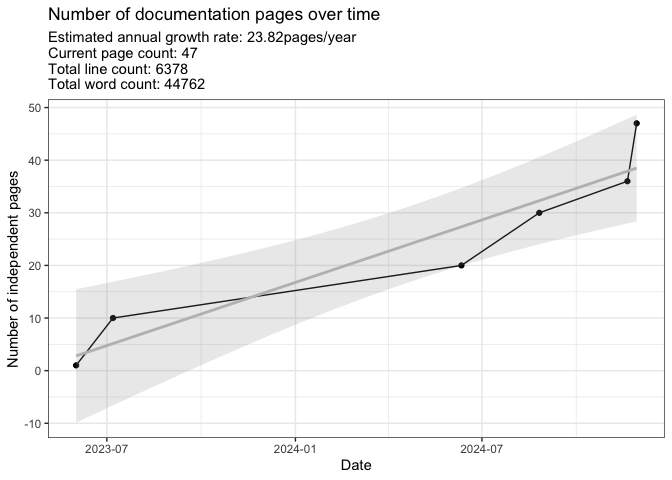
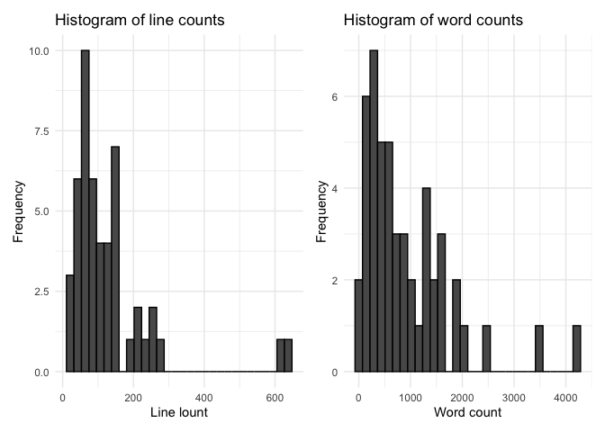

# Documentation log count

Last update:

    ## [1] "2024-11-29"

This doc was built with:
`rmarkdown::render("file_count.Rmd", output_file = "../pages/file_count.md")`

Below is the latest count of documentation pages. This figure is updated
sporadically to track the current page count and estimated growth rate.
This count only considers the main sources in `./pages` but ignores
other code pages, images, etc.

<!-- -->

    ## Regression Summary:

    ## 
    ## Call:
    ## lm(formula = FileCount ~ DateNumeric, data = df)
    ## 
    ## Residuals:
    ##      1      2      3      4      5      6 
    ## -1.804  4.847 -7.339 -2.298 -1.910  8.503 
    ## 
    ## Coefficients:
    ##               Estimate Std. Error t value
    ## (Intercept) -1.270e+03  2.294e+02  -5.538
    ## DateNumeric  6.525e-02  1.156e-02   5.643
    ##             Pr(>|t|)   
    ## (Intercept)  0.00520 **
    ## DateNumeric  0.00486 **
    ## ---
    ## Signif. codes:  
    ##   0 '***' 0.001 '**' 0.01 '*' 0.05 '.'
    ##   0.1 ' ' 1
    ## 
    ## Residual standard error: 6.361 on 4 degrees of freedom
    ## Multiple R-squared:  0.8884, Adjusted R-squared:  0.8605 
    ## F-statistic: 31.84 on 1 and 4 DF,  p-value: 0.004857

    ## Estimated Annual Growth Rate (pages/year): 23.82

    ## Current count: 47

<!-- -->
